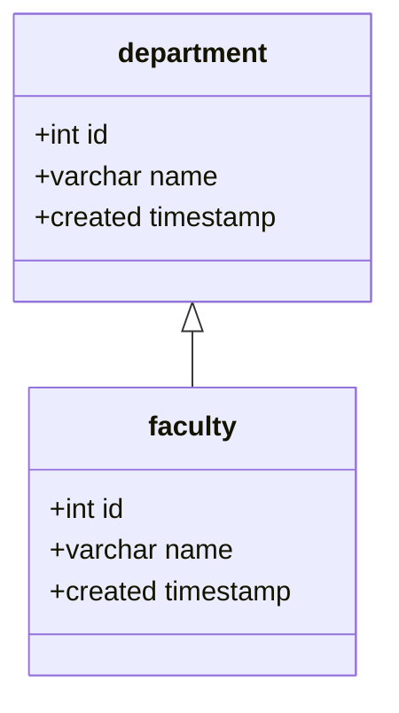
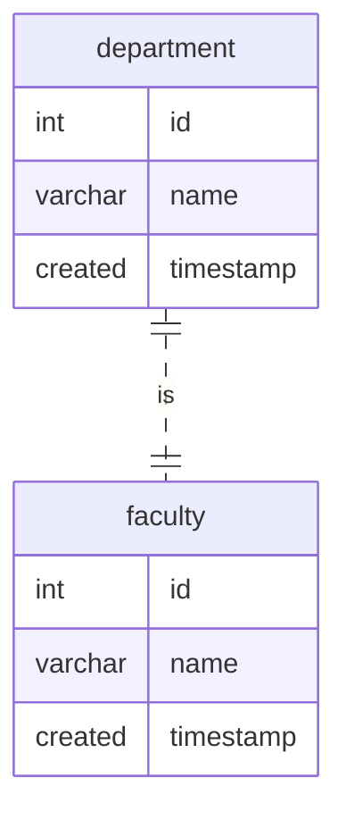
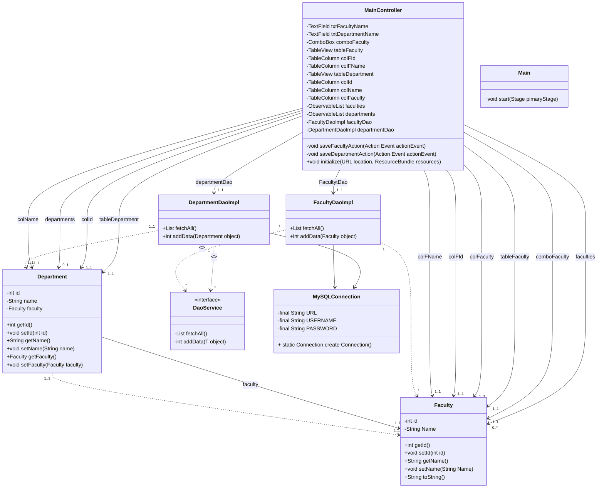

# 🏫 Sistem Manajemen Fakultas dan Jurusan
> Sistem dapat digunakan untuk merekam data pembuatan fakultas dan jurusan, termasuk waktu pembuatannya.
> Fakultas dan Jurusan dapat memiliki lebih dari satu entry.
Dibuat untuk memenuhi tugas final project mata kuliah Pemrograman Berorientasi Objek, 20/21 Ganjil, S1 Ilmu Komputer, Universitas Lampung. 

🧰 Library dan Alat dari proyek ini:
- mysql-connector-java-5.1.xx.jar
- Scene Builder
- MySQL server
- NetBeans

## ✏️ Desain
Untuk melihat diagram di bawah ini, instal plugin mermaid-diagram di https://github.com/Redisrupt/mermaid-diagrams

### Class Diagram

### ER Diagram

### Desain Class Diagram untuk JavaFX dan Database

